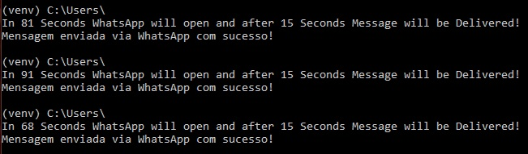

# Preço do Bitcoin

Este código em Python verifica periodicamente o preço atual do Bitcoin na Coinbase e envia uma mensagem via WhatsApp se o preço cair abaixo de um limite definido. 

Utiliza as bibliotecas 'requests' para acessar a API da Coinbase, 'pywhatkit' para enviar mensagens via WhatsApp e 'time' para controle de tempo. 

Para utilizá-lo, configure o URL da Coinbase, defina um limite de preço e o número de telefone para receber as mensagens no WhatsApp.

Certifique-se de ter as bibliotecas instaladas e configuradas corretamente para o código funcionar.

